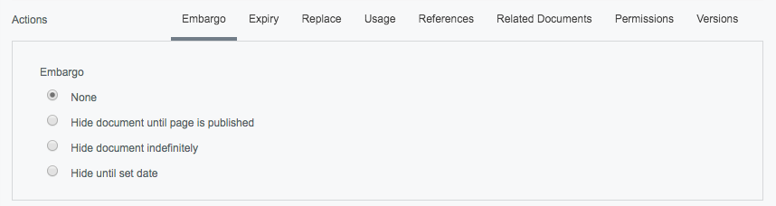
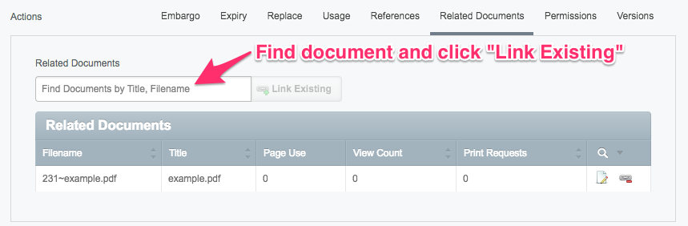
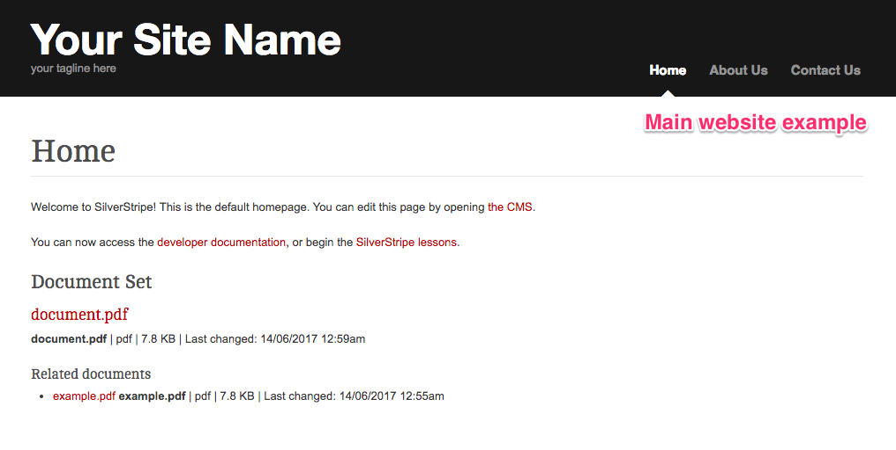
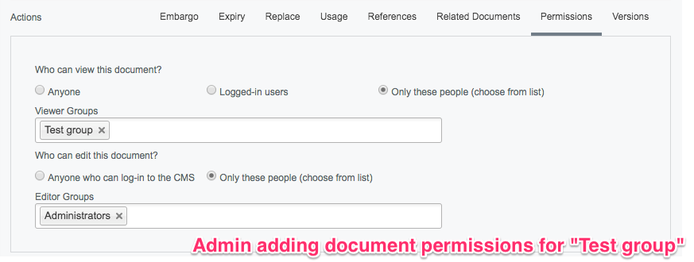
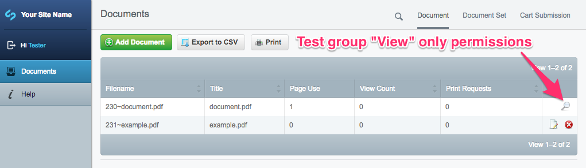

# Setting permissions on a document

You can edit a document’s details and permissions inside a "Document Set" or in the **Documents** area under the "Document" tab by clicking on the document in the list. Here you will find where to change the "Title", "Description", "Cover Image", "Download behaviour" and "Actions" of your document.

There are various options that you can set for particular documents under the title "Actions".

**Embargo**

"Embargo" is where you can choose to set your content to draft then have it automatically published on a set time and date.

**Expiry**

You can also set your document to expire on a particular date under the "Expiry" tab. Expired documents will immediately stop showing up on the main website. Visitors cannot view unpublished content but you can access it in the CMS. For both "Embargo" and "Expiry" settings, simply select a date from the calendar date picker and enter the time you need.

**Replace**

The "Replace" tab allows you to replace a file using drag-and-drop or by attaching a file from your computer.

**Usage**

The "Usage" tab shows what pages the current document is used on.

**References**

The "References" tab will show you pages where the current document has been referenced in the HTML content, such as adding shortcodes to documents which direct to content.

**Related documents**

The "Related documents" tab allows you to link related documents to a document. Related documents will be displayed in a list underneath the main document when viewing the associated page on your website. This example shows "document.pdf" with its related document "example.pdf".

_**Note:** You can link any document in the DMS to any document set. A document does not "belong" to a specific set. For example, if you upload a document to set-A, then relate it to set-B, then unlink the document from set-A, the document will stay on set-B._

You can set various permissions for different user groups under the "Permissions" tab such as "Who can view this document?" and "Who can edit this document?". For example, if the group "Test group" is able to view but not edit a document, the group will see a magnifying glass icon to only view uneditable information of that particular document. When viewing the main website, only users logged in and belonging to the "Test group" will be able to see the document.

**Versions**

The "Versions" tab shows you old versions of the document if you have previously replaced it.
