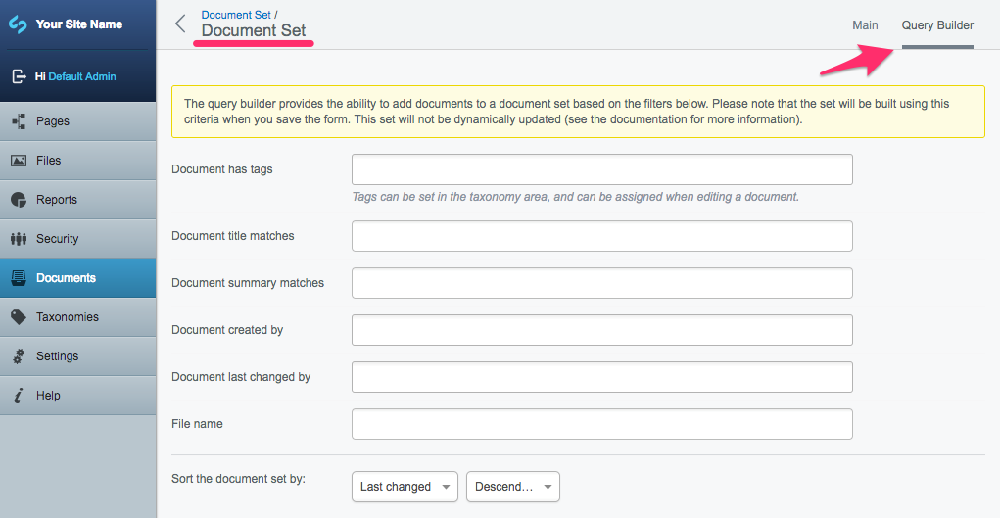

# Query Builder

## Bulk add documents to a Document Set

The query builder is an easy way to add multiple, similar documents to a Document Set. To see the "Query Builder" tab, navigate to the Document Set you want.

Using a selection of criteria, query builder allows you to search for and automatically add relevant documents to the current set. The fields in this section are developer configurable, and may include things such as "title matches", "order by" and "tags match" (if the [taxonomy module](http://addons.silverstripe.org/add-ons/silverstripe/taxonomy) is installed).

Once you define query builder criteria, the results will be built when you save the document set.
